# Fallout 3 Speed Cripple Disect

I was watching a Fallout 3 speedrun and everyone was talking about how horrid
the Speed Cripple glitch was to get. It always sounded like it was random,
but sometimes seemed it was in a "good state" and there would be little
problems getting it. The Fallout glitch God, Kungkobra, said I was welcome
to try to figure out a way to make it stable, and for some reason I was obssessed.

The urge to figure out what is going on behind the infamous Fallout 3
Speed Cripple glitch consumed me, even if I couldn't fix it.

Here's what I found.

# Disclaimer (TLDR)
### Pseudo fix

There still really isn't a fix for this.
The best I've come to is controlling what threads Fallout runs on,
while also moving everything off Fallout's cores/threads.
Very well could be luck or wanting to believe it helps.

**windows** - `start /affinity 3 Fallout.exe`

**linux** - `taskset -c 4,5 wine Fallout3.exe`

### What happens?

Your animations change when you get crippled.
A 3rd person animation is used in 1st person when you are crippled.
This animation seems to compensate for your slower `player/character speed`
and less `1st person animation distance`.

When you freak the game out, you end up with the 3rd person animation,
but regular player speed and 1st person animations.

Boom, you now have speed cripple.

# Disect

## Where to start?
\============================================================================

Some people said they had no issues getting SC (Speed Cripple) offline,
but streaming or capturing would make it almost impossible.
Others would say it was easier to get on older hardware.

Had a few hunches about threads and FPU but wasn't really sure what was going on.

Older CPUs were slower, so I tried to lower my CPU clock speed - no dice.

When FO3 came out I was running it on a Core2Duo: no more than 4 cores/threads.
Limiting FO3 to only a couple threads on a single core *seemed* like it yielded better results.
But it was still inconsistent and I still had no idea what the actual cause was.

From here there is only one way to go - into code.
A good debugging start was running `strings`,
a common tool to grab text strings from a file.

`strings Fallout3.exe`

The [dump of strings output](./fo3_strings.txt) can contain some garbage,
but from everyone's consensus, it sounded like your speed was getting increased about 1.6x,
so I looked for "speed", "run" and the like.

There were a couple values that were familiar or seemed to do with speed.

<pre>
fMoveRunMult
SpeedMult
</pre>

## The Process (debug 101)
\============================================================================

Hunting down variables was a common task. If you haven't debugged
a game before, this is the process.

Luckily, Bethesda has an in game console that allows you to get
and change engine values. This was the biggest help with finding
values to set breakpoints on and work from there.

Occasionally I'd use a "game cheat memory search" tool to find
values, but this was before knowing the in-game console/engine references.

Finding memory locations of variables went something like this...

#### The easy way

 - run `getgs fMoveRunMult` in game
 - (the game tells you it's `4`)
 - search memory for the value `4`
 - `setgs fMoveRunMult 5`
 - search memory results for the new value

Eventually you get to a memory location
(that may be static or dynamic - usually dynamic),
set a breakpoint - and bob's your uncle.
You start hitting areas in code that reference the variable you're looking
for and can get to crackin'.

#### The hard way

Some values ended up not being what you set. Searching memory for
greater/lessthan values becomes a pain. Some scripting is possible
to automate searching but it's still undesirable and clunky.

The alternative ? You can set a breakpoint on the string itself
you want to look for.

 - find the string (e.g. "fMoveRunMult") in memory (may have multiple hits)
 - set a breakpoint on byte access
 - you end up somewhere in the game's text/ascii display system

From here you have to pay close attention. There are format string
prints like `"%.02f"` you have to look for. Sometimes you have to
back trace rets, set breakpoints before the string is accessed,
and *eventually* find a memory location.

Set a breakpoint in code, make note, and don't go through this again.

## Start cont... (speed search)
\============================================================================

`fMoveRunMult` lead to a couple functions I didn't quite understand yet.
I could see it was only called under certain circumstances
(changing armor, drawing/holstering weapons, getting crippled).
And that triggering calls would usually change the end values.

#### fMoveRunMult referenced (F61098)

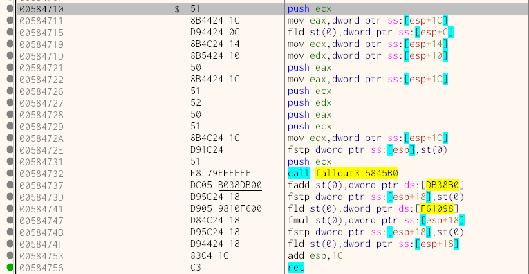

#### Speed() function called inside wrapper
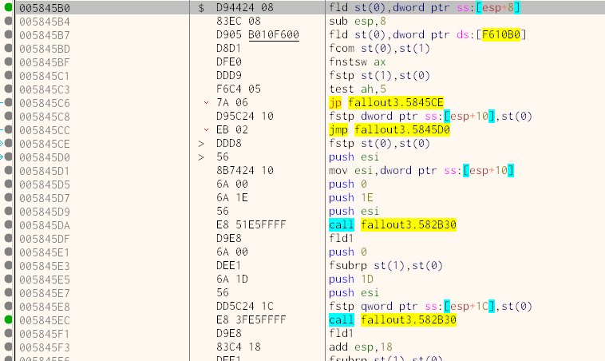

I noticed the common explanation of speed being increased didn't happen
when you actually got SC. There would still be the same float value
(e.g. `325`) for speed when you load a game, and after getting SC.

My scatter brain got the better of me and I started looking elsewhere.

I gathered a [useful string list](./useful_strings.txt) to get going.
Most of these were dead ends, some were leftovers from Gamebryo's engine.
Other values seemed unused, or related to the Havok physics engine.

## Not speed...Where to next?
\============================================================================

I figured in a 3D game the actual thing "moving" is the camera, not the player.

These are the two main camera strings that caught my eye and lead somewhere.

<pre>
IsPC1stPerson
sUActnTogglepov (ended up with nothing)
</pre>

#### Camera POV code

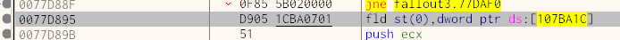

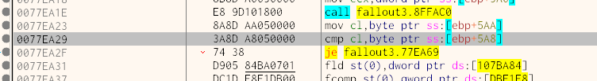

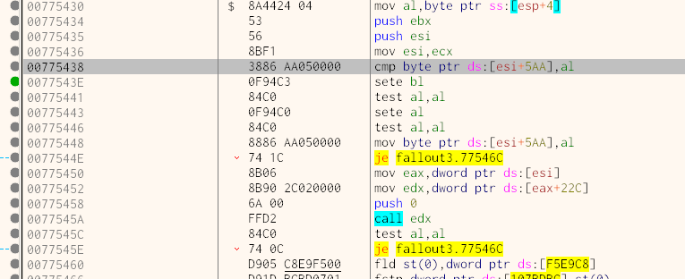

Getting here wasn't exactly helpful, and didn't have a hint of movement.

Some of the "useful strings" I collected were more of the same.
Code that didn't clearly lead to anything SC related,
and/or I couldn't piece it together yet.

But there were a couple variables I initially overlooked.

### Mobility Condition (Limb Health)

<pre>
LeftMobilityCondition
RightMobilityCondition
</pre>

These variables probably tripped me up the most. I could not find limb related
values anywhere, completely missed this while looking at strings,
and got lost looking at camera and game quick/load functions.

Why didn't I find them sooner? Limb health is not 0-100, 255,
or even a sensible float value. They seemed to be based around 77 (hex)
and had to be found looking for greater- and less-than values.
They would bottom out around 30s (hex) and got no higher than
low 100s (hex). This ended up leading somewhere I've been before,
where `IgnoreCrippledLimbs` was. But it had a lot of depth
so I didn't bother going further.

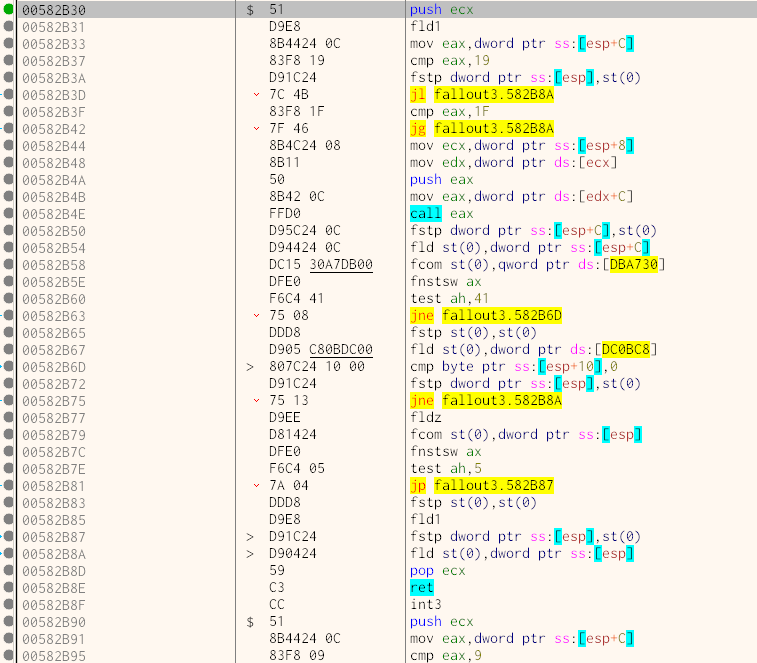

This actually got called somewhere else familiar, twice in fact.
The speed function. (582B30)

The player speed side was making more sense.
But it still didn't seem like it was related to SC directly.

## Animations
\============================================================================

There was still one thing that I didn't look into. 
And if you've messed around with SC, there's a really big clue.

When you have SC, you only go faster in 1st person. In 3rd
person you have a cripple animation but your real
world speed is obviously slower. I downloaded a BSA file
extractor and NifSkope to start examining animations.

There was a string I saw referenced a few times in the debugger
crossing other code -  `1hpfastforward.nif`.
Comparing the `\meshes\characters\_1stPerson\locomotion` normal
vs "hurt" animations there was an obvious differences.

**FastForward_Hurt** 

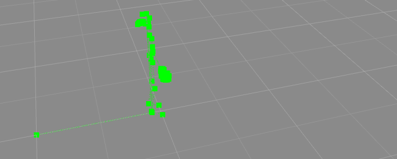

**FastForward normal**

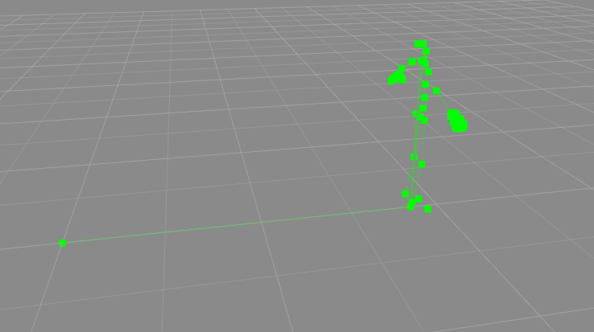

They move forward a different amount, about half or twice as far.

I knew there was a way to override the animations with modding
but hadn't modded FO3 in a while.
Luckily a avid modder, Cheefii, reminded me how to go about it.
Not only was I going about using "Loose Files" wrong, but like
Cheefii said, "Make sure you have the right file."

1hpfastfoward is **not** the right file. Replacing `fastforward`
with the `hurt` version wasn't showing in game. But I wasn't
doing "Loose Files" wrong anymore. Double and triple checking,
making sure the filenames were right, I had to check memory.
Searching memory for animation files came back with nothing.
Searching for parts of animation files came back with nothing. 

Cycling through the "forward animations, I found the **right animation**
is `mtfastforward`. This WAS in memory. And it would hit breakpoints.
Finally got somewhere.

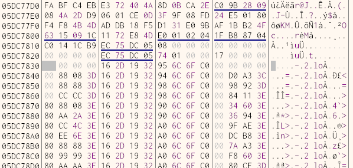

It was only part of the file. Because of how things are loaded
and used, only partial, crucial bits are stored in memory. Some
leftover info from the beginning of animation files may be
present in memory, but for the most part they get cycled
through and then the memory is re-used. There was also some
data around the animation data itself that wasn't clear.

The animation itself was also a bit different.

**mt FastForward_hurt**

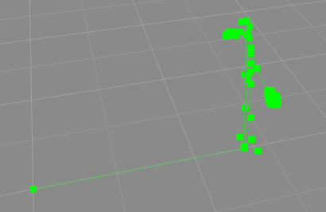

**mt FastForward normal**

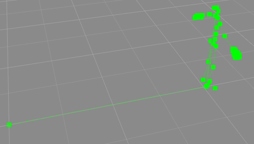

**1hp FastForward normal**

Compared to `1hpfastforward` the `mtfastforward` goes
a bit farther in 3D space.

Finally figuring out the right animation, things started to speed up.

## Animation functions
\============================================================================

Setting a breakpoint on `mtfastforward` data verified
the animation was being used. As soon as you press
forward (**W**) the game is interrupted. The function
gets routed through a few calls.

### Animation data breakpoint

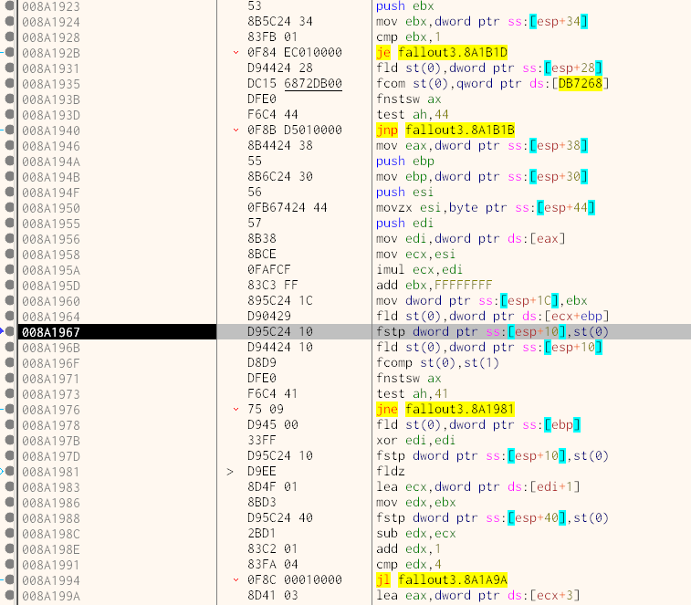

### Animation function call 1

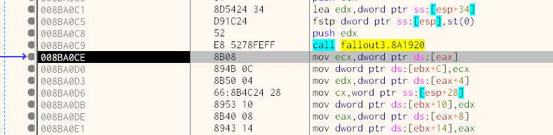

### Animation function call 2

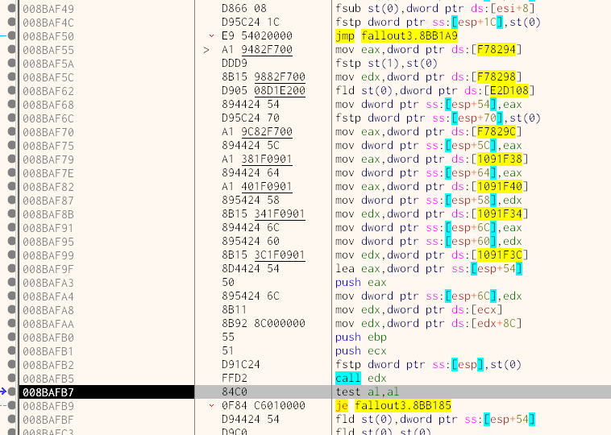

(Dynamic functions that result in something like `call edx` are common in FO3's code.)

This last call has a bunch of hardcoded references before it.
Some hardcode locations are values, others are pointers, there's
even tables of functions to be called inside these.

### Animation outer function

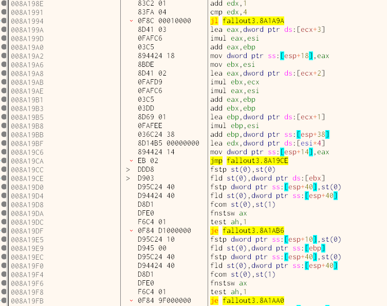

The code here and before deals with frames and animation types.
Once all that is determined, the animation
is used in different ways in separate functions.

### Hardcode function pointer

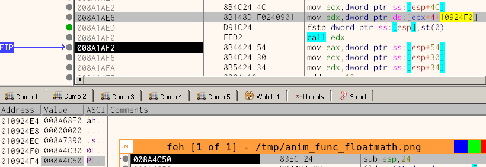

This `call edx` is sourced from the table at `10924F0`.

### MTFF Animation math
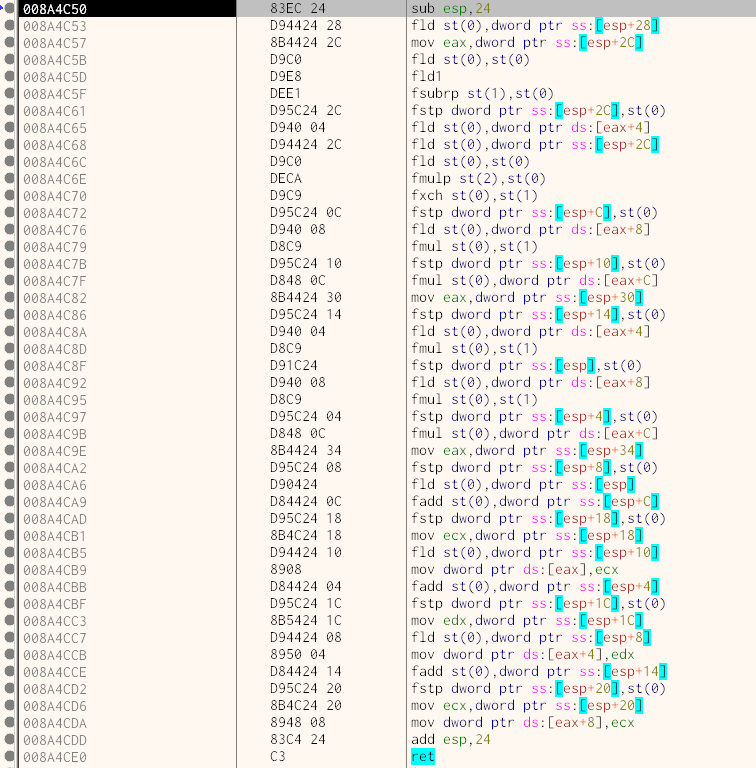

What's related to `mtfastforward` is handled in a function at `8A4C50`.
I assumed these were 1st player skeleton movements. What I was looking
for a difference in values. The FPU (Floating-Point Unit of the CPU)
works a bit differently than standard registers. Without digesting
everything here, an animation value gets read and transforms
a piece of data. The easiest way to conceptualize this is matrix
math (sometimes with some conditionals applied).

<pre>
   input                   anim operation+data             output
[ 0.0,  1.1,  5.1, -2.3 ] [ +0.3,  *.5,  -.2,  +0.4 ]  [ .3,  .55,  4.9,  -1.9 ]
[ 1.0,  0.0,  2.3,  4.2 ] [ +0.0,  ?=0,   +2,  *1.1 ]  [ 1,   0.0,  4.3,  4.62 ]
[ 6.0, -0.4,  2.3,  3.1 ] [ ?<6,   *2.4,  +2,  *1.1 ]  [ 6,   -.4,  2.3,   3.1 ]

</pre>

(Fun fact. Float operations are not always precise. Especially
when moving between FPU and CPU. A value of `4.621119` may become `4.621`.
This is an over-simplification, but bits can get cut off.)

At this point I still didn't know how to tell more than "number different".
And there were a lot of numbers going on. Animation data did seem
consistent in memory when getting SC - not the memory location but
it wasn't corrupted in any way. It was still the same `mtfastforward`
being accessed when you have SC.

Doing some simple testing like modifying a single animation float to
be 600 instead of 0.3 did lead to interesting results;
like propelling so fast it caused the physics to register a "hard landing"
where the player stops like they fell far, but not far enough to damage limbs.
It was enough to convince me I was on the right track.

There was another value right before the animation data that didn't seem
to change. It was always `174` (hex), and adding that value to where
the data started was the perfect size to hit the end of the animation data.

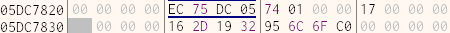

## Animation formats
\============================================================================

There was a lot of back and forward looking at game loading and animation data.
This is how the animation data shook out and what lead to the previous
code making any sense.

### Animation beginning

### Animation ending

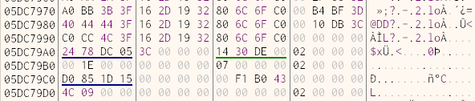

There was the `174` (hex) size of `mtfastforward` that stayed constant.
Around the animation and size were these highlighted dwords
(32bits, 4 bytes). These are highlighted by the debugger to signify
they are possible pointers to data (blue) or code (green).
Looking at the first one near the end of the animation data, and
going through a little endian hell, shows it's a reference to the spot
this animation begins.

I made a [script to crawl animation pointers](anim_crawl.scr) and quickly
found out...there are a LOT. This is a vector added to over time. Some
animations may have garbage around them (text from radio, quest, so on).
Some pointers started and stoped immediately, a few bytes away.

Searching for some of these pointers in memory didn't find much.
But if you search for values next to them, like where the animation data
starts, you get some hits. At first these seemed like garbage. But
going back and setting breakpoints shows that the previous animation code
doesn't get these addresses directly, but from data structures with base
pointers to these pointers.

**Animation pointer-pointer code**

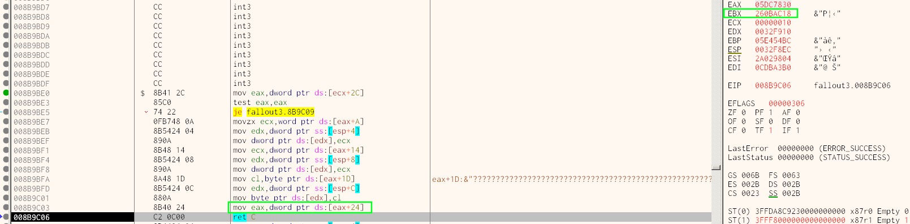

This `ebx` value has a base used to get the pointer for yet
another pointer to the animation data.
Then `eax` (prevously the 1st level pointer to an animation) overwrites
itself with the direct pointer to the animation being used.

**Animation pointer1**

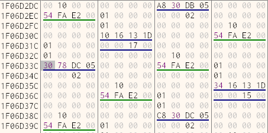

**Animation pointer 2**

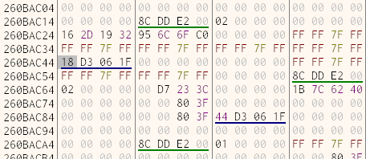

How to grab crawl the pointer pointers (mind endian)

 - search for animation data
 - search for the animation's start address (4 bytes after the anim length)
 - get the 1st level pointer address
 - subtract 24 (hex) from that address
 - search for the adjusted address
 - result is the second level pointer

Going through bits of code while looking at these
areas of memory and tracing them landed a few important values.

The second pointer has a `current frame` counter next to it.

The first one has a `animation size` (17 hex) and a `chunk size` (10 hex).
There are 17, 10 chunks (170 bytes total)

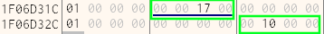

This was nice to know, but SC was still unexplainable. And trying to
reverse every animation and data type seemed out of the question.

What happens when these values get loaded - and where do they get loaded?
Maybe animation lengths or sizes are corrupted?

# Quickload (Load with a wrapper)
\============================================================================

`quicksave` is a hardcoded name in memory and easy to use.
Leads to FO3 QL (quickload) function at `6D5920`

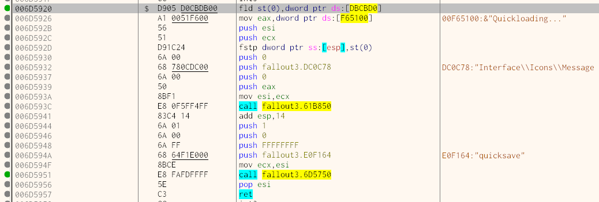

The second call, calls to "load" proper. If you choose a file and load
it, the debugger will break here. (It's right before QL in memory.)

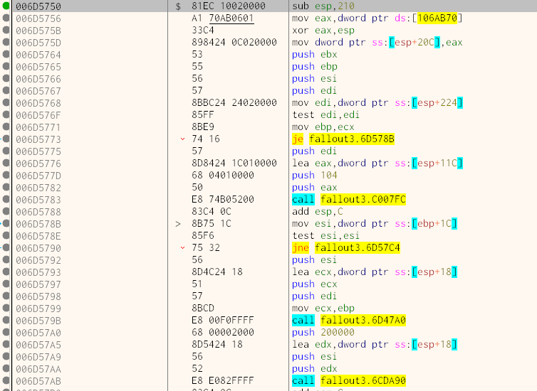

Unfortunately, this is where things looked grim.
Stepping over/into each call, searching for `mtfastforward` in
memory ended up proving one thing.

Loading animation data is threaded.
There are two big give-aways that game object loads are threaded.

InterlockedDecrement and InterlockedIncrement - which are atomic functions.
(they freeze the CPU access to memory to ensure multiple threads can't
access a resource at the same time)

RtlEnterCriticalSection and RtlLeaveCriticalSection which are related to
threads getting access/ownership to memory.

Going through QL wasn't leading anywhere. Stepping a single instruction could
give another thread the OK to run, and debugging threads is hell. FO3 is
fairly large, too large to be able to collect all information on threads,
or pause them and step through each. Plus these were relying on each other
for memory addresses, allocation and probably just signaling - trying to do
anything fancy only brought crahses.

# Animation loading, try 2
\============================================================================

Back to the animation data, the size seemed like it would have to be used
when loading the animations, right? Breaking on them didn't exactly get to
a "load", but more of a "check".

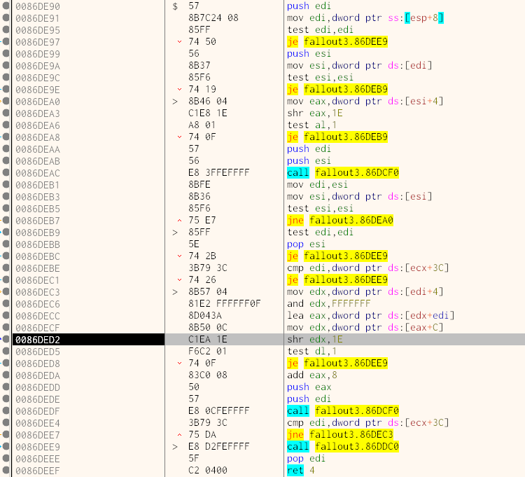

From what I could tell, this and everything around it was looping through
every animation in the `Fallout - Meshes.bsa`. Ultimately it was the same
as trying to poke around QL - one instruction will get `mtfastforward` in
memory.

(There's a lot of string functions here... Things like
chop "\characters\_male\locomotion\hurt" to "\locomotion")

One important take away is that the `animation length` from earlier can
get a `40` (hex) binary `or`'d onto it. I think the `40` signifies a "disabled"
animation, or maybe un-needed. Some animations in the animation vector have
this `40` in their length, and those animations were either missing data or it
was incomplete.

# Breakthrough
\============================================================================

At this point there was still no answer to why SC was happening. I started
dumping memory and doing mass searches for anmations. Cut up all of the
locomotion 1st and 3rd person animations and did some compares between a fresh
game load, one with a bunch of QL-ing, some crippled instances and some with SC.

It actually showed something interesting. Animations were not always
loaded in identically except for a fresh load. There had been times trying
to debug there were one or two locations with the same animation data. I
didn't really think anything of it and figured QL was just loading the same
stuff in twice, and that it was leftover. But what if it wasn't? Was it
being re-used? What if SC was using hurt and normal animations together?
The animation vector was too big to take on, so I decided I'd limit it
down to only what animations ARE being used.

 - find an animation in memory
 - breakpoint the data
 - see if it hits anything

I found out that for some reason, **3rd person** had a **`mtfastforward`** animation.

Except it didn't have a `mt` animation for regular movement - 
it had a **`mtfastforward_hurt`** animation. I tried to hit on it
and bam - 1st person used the 3rd person animation.

I've been through so many dead ends at this point I was excited and losing
hope at the same time. I figured I'd try something less involved and half
assed, and loaded the 3rd person animation in `mtfastforward` and felt crushed

**1st person (data\meshses\characters\_1stPerson\locomotion)**

---

|animation|replaced_by|animation|result|
|----|----|----|----|
|mtfastfoward         |replaced_by   |mtfastforwrad_hurt |you go slower (as expected)|
|mtfastforward_hurt   |replaced_by   |mtfastforward      |you go faster once hurt, but not SC fast|

**3rd person (data\meshes\characters\_male\locomotion)**

---

|animation|replaced_by|animation|result|
|----|----|----|----|
|(1st)mtfastforward   |replaced_by   |(3rd)mtfastfoward_hurt |your camera turns left and you go slow, weird huh?|
|(3rd)mtfastforward_hurt |replaced_by   |(1st)mtfastfoward |your character is halfway in the ground, sideways, pretty slow|

The 3rd person `mtfastforward_hurt` was moving the camera and making you slow, uncrippled.

I was about to call it but noticed this string of leftover text next to the
animation I was looking at in memory.

From President Eden over the radio...

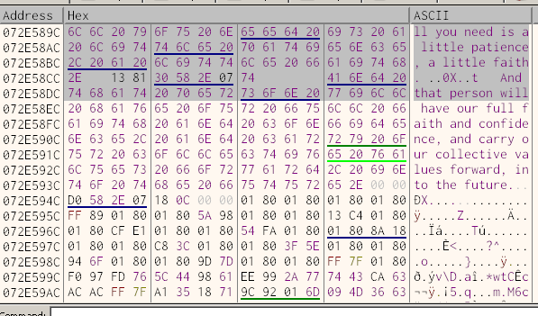

Legit LOL. Decided to truck through a bit more, and the next step finally showed
what was going on.

|animation|replaced_by|animation|result|
|----|----|----|----|
|(1st)mtfastforward_hurt |replaced_by  |(3rd)mtfastfoward_hurt |you go faster once hurt, but not SC fast|

FINALLY - it made sense.

Replacing 1st person `mtff_hurt` with the 3rd person `mtff_hurt` animation
had the same effect as being replaced by the 1st person `mtff` animation.

**3rd person `mtff_hurt` actually moves you more to compensate for your
slower player speed and reduced 1st person animation travel distance.**

### Crippled normally

Normal 1st person animations get replaced by "hurt" versions that are slower.

You get a new 3rd person animation.

You also get your player speed reduced.

|status|multiplier|
|----|----|
|not crippled| 1.00x|
|1 leg crip  | 0.85x|
|2 legs      | 0.75x|

Combined, you go slower overall.

### Speed Cripple

You get crippled but quickload -
the game threads different loads at the same time.

You get the 3rd person `mtff_hurt` animation attached to your current set.

You get your limbs and player speed restore to your pre-crippled save.

Normal 1st person animations are loaded.

1st person "hurt" animations don't get loaded

### Unwanted glitches

There are still mishaps like reverse speed, or temporary SC. I had these
happen way less in testing and didn't chase after them, but I have to
assume it's the same mechanics.

You can get fast*forward but not fast*right, left, or back.
(IME left was usually a slow direction, maybe it gets loaded first?)

You may disable an "normal" 1st person animation and any check done
(like another QL) will remove your new 3rd person mtff_hurt animation.

Or, maybe you get no 3rd mtff_hurt animation but reduced player speed,
and there's no compensation from the 3rd person animation doesn't move
your camera faster.

### Problems

The exact setup to perform SC is still a uknown. Maybe there's a way to
set up certain threads and memory, turn off as much randomness as possible:
like grass, AI, terrain, draw distance, etc. It could be an RNG hell hole.

Other programs running will cause your OS to move programs across threads
and cores. It will cause different areas of memory to be used. Using a
swap/page file may affect how fast some memory actions are. There are a
lot of variables to account for. Windows 2003 (XP) changed the way
"Critical Section Objects" (threads) work, maybe something else
changed since then?

As stated at the beginning, the best luck I had to reproduce SC was starting
FO3 on certain threads and kicking everything else off of them.

**windows** - `start /affinity 3 Fallout.exe`

**linux** - `taskset -c 4,5 wine Fallout3.exe`

This could be my imagination. I did notice having anything media heavy
running seemed to drastically reduce my odds, and other's have said the same.

# Outro
\============================================================================

Either way, I'm just glad to know what's going on. I didn't expect to learn
nearly as much as I did about Fallout 3's code. I thought it'd would be
a quicker path to more or less the same result. Animations weren't even on
my radar until I dug into everything.

This was my first time really opening a debugger in years. Felt good to get
where I was going. The universe teasing me at the end with Eden's
"have a little patience", good stuff.

There are parts I left out that were either time sinks or distractions.

Hope it's been interesting for at least someone out there.

Keep breaking shit =)

# Misc
\============================================================================

## Tools used

x64dbg, gdb, strings, gameconqueror, NifSkope, BAE (Bethesda Archive Extractor)

## Un-obtainables

**Threading** - debugging exactly what is going on would be nice

**Input** - without remote debugging I'm not sure it's possible to trace things
with keybord or mouse input. The game pauses immediately when it notices
it isn't the center of attention. Not that important I guess.

## Files

`strings Fallout3.exe` output [fo3_strings](./fo3_strings.txt)

Trimmed [useful_strings](./useful_strings.txt)

A file with a "name" and "signature" to search on.
(These are not all accurate and may find more than one location.)
[animation signatures](./animation_signatures.txt)

[breakpoint list](./bp.txt) dumped from x64dbg

[anim_crawl](./anim_crawl.asm) x64dbg script

## Code digest

[player speed](./player_speed.asm)

[speed backup](./speed_backup.asm)

[limb hell-th](./limb_health.asm)

[animation](./animation.asm)

[movement direction](./anim_move_dir_status.asm)

[cam pov](./cam_pov.asm)

