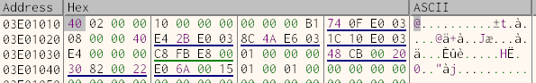

# Void Swimming Glitch

I was interested in this glitch back when I originally started digging into
Speed Cripple. Guess I became too distraught in not finding an answer that
I just never looked into this. Recently lovely Speed Cripple was brought up
again and I decided to look into this first for insight, and since I never
did originally.

If you've watched a speedrun of Fallout 3, then you've probably seen this
in action inside Little Lamp Light. The glitch is simple.

- qs/ql clip out of bounds to where the water just 'ends' mid air
- swim from the water into the void
- quick save while swimming in the void
- swim to normal water
- quick / regular load
- you can now swim until you hit water or land (or probably any physics)

There are a couple variations that don't work, for instance if you order
the save and load spots wrong, you may think you're void swimming but a
first jump will make a water sound then a landing on ground sound and you
fall through and reload at the COC of Little Lamp Light.

Note: you can still drown while in void water :)

# TLDR

## What happens?

Simple, the game **just** works (as in barely). When game quick loads it
doesn't fully check the current movement status of the player. I was more
focused on speed cripple after getting this far and didn't find the exact
things going on, but the physics and/or animations of the save file versus
what's in memory aren't compared and removed properly. The save file
contains the fact you were 'swimming' (abliet in the middle of nothing)
and on game load this data is trusted. The current physics/animations
(in memory) seem to match the save file (or aren't caught because you're
in the void). Semi-glitch cases of having 'swimming' sounds after a load,
but where you immediately fall on jump, must mean the game saw you were
'swimming', but not in water. When player motion/movement doesn't match
up with what's currently 'attached' to the player (swimming animations
or physics) you get a single jump or begin to fall immediately.

# Dissect

### Class Begins
\============================================================================

It was brought up that fose (Fallout Script Extender) and NVSE (New Vegas SE)
had a lot of game classes already mapped out. They even have different addresses
per version of the games. I originally got mixed up over things being single
pointers, or pointer to pointers, and not starting to count from 0 for bit '11'
because that's what computers do. But eventually after looking at some of my
old notes on speed cripple and matching things up, I came up with this.

`0107A104` is a pointer to the `player` class, and as fose points out, has a
pointer to a `mover` class 184 bytes ahead of that.

After realizing bit '11' in the comments for 'swimming' meant 'bit 12' it was
easy enough to hold a direction, pause, compare memory and see 94 bytes into
the `mover` class had the current direction of the player.

`107A104` points to `3E617F4`, +184 bytes is `3E61978` which points to `3E00F7C`,
+94 bytes is `3E01010` which finally holds the direction bits of the player.

#### Player Pointer

#### Player Class

#### Player Mover Pointer

#### Player Mover class 'direction' (94 bytes ahead)

It's briefly mentioned in the fose source from what I saw, but the bits from
right to left map out like this.

|bit 0 index|bit 1 index|motion|
|----|----|----|
|0|1|forward|
|1|2|back|
|2|3|left|
|3|4|right|
|4|5|look left (mouse)|
|5|6|look right (mouse)|
|6|7|alive? (always set)|
|7|8|unknown|
|8|9|walk|
|9|10|run|
|10|11|sneak|
|11|12|water|

swim/water bit-> `0000 0100 0000` <-forward bit

> Note: none of these seemed to be 'jump' or 'in-air'

> also interesting, I didn't know this, you can 'sneak' in water

### Sink / Swim

I started to break on anything touching movement bits but of course this
is looked at often. However breaking on QL I did notice, the player is
only set up and destroyed on game start and exit. So it was easy to set
breakpoint on QL, then enable a breakpoint on player movement bits, and
see what was being checked where. After a good amount of digging, one
area seemed to look interesting.

There is a large function around `711D60` that does some type of motion
setup. There are a lot of references to the player pointer `107A104` and
conditional branches. Around `712512` there is an interesting string
reference pointer hardcode to `DB9254` with a value of `333?fFadeInTime:LOD`.

There was a bit of code after this at `712A13` that was breaking if you were
in water vs on land. Fiddling around a bit and getting no where I knew there
had to be something higher up in `711D60()` that decided if the player was
in water or not. I got lost in FPU hell a bit (a lot of this code will use
the FPU registers to do weird compares on parity and error conditions that
make my head spin) - but ended up going with debugger 'tracing'. Knowing
the location I was interested in, I set a trace to give the current address
running per instruction, and told it to step **over** any calls (so only
to stay tracing if it was still inside `711D60`).

Running twice (quick loading for void swimming and raw load in void)
I was able to compare the two lists to see what was different.
Something like...

`comm -3 trace_void_proper.txt trace_void_swim.txt > trace_cmp_prop_vs_swim.txt`

The first address shown to be hit for void swim was `712501` just above the
`fFadeInTime` check. There was a call just before this that returns with a
value that determines swimming and stores it on the stack. It's later checked
by FPU calls. But after I looked into this and got lost I assumed what made
sense for void swim to work - the game just doesn't properly validate player
movement, animations and physics. Then I went back to Speed Cripple :)

